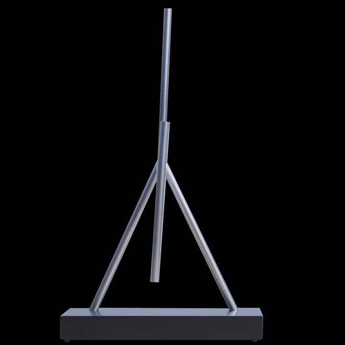

<h1 align="center">Discovering-of-Governing-Equations-DMD-and-SinDy-for-Nonlinear-Physicla System The Kinetics Sculpture System</h1>
<p align="center">
    <a href="https://arxiv.org/pdf/2206.05483.pdf"></a>
    <a href="https://github.com/AlanPeng0897/Defend_MI"></a>
    <a href="https://dl.acm.org/doi/abs/10.1145/3534678.3539376">  </a>
</p>
<!-- label - message - color -->
<p align="center">
  
</p>
 


 # Physics-Informed Machine Learning: Discovering Governing Equations from Data


[](https://python.org)
[](https://pysindy.readthedocs.io)
[](LICENSE)

---

## Overview

This project applies **SINDy (Sparse Identification of Nonlinear Dynamical Systems)** to automatically
discover the governing differential equations of physical systems directly from time-series data —
without any prior knowledge of the equations.

Given noisy observations **x**(t), the algorithm finds the sparse function *f* such that:

> **ẋ = f(x)**

by solving a sparse regression over a library of candidate functions Θ(**x**):

> **Ẋ = Θ(X) · Ξ**

where Ξ is a sparse coefficient matrix recovered via **STLSQ** (Sequential Threshold Least Squares).

---

## Systems Studied

| # | System | Type | True Equations | Challenge |
|---|--------|------|----------------|-----------|
| 1 | **Van der Pol Oscillator** | Nonlinear ODE, limit cycle | ẋ=y, ẏ=μ(1−x²)y−x | Cubic nonlinearity |
| 2 | **Lorenz System** | Chaotic 3D ODE | ẋ=σ(y−x), ẏ=x(ρ−z)−y, ż=xy−βz | Sensitive dependence on ICs |
| 3 | **Damped Pendulum** | Nonlinear ODE with trig | θ̇=ω, ω̇=−(g/L)sin(θ)−bω | sin(θ) in nonlinear regime (θ₀=143°) |

---

## Experiments

The notebook runs 6 structured experiments:

**Part 1 — Van der Pol Oscillator**
- Simulates 3000 time steps (t ∈ [0, 30], μ=1.5)
- Fits SINDy with polynomial deg=3 library on clean data → exact equation recovery
- Noise robustness study across 5 noise levels (0%, 1%, 5%, 10%, 20%) using smoothed finite differences

**Part 2 — Lorenz System**
- Simulates at dt=0.002 for t ∈ [0, 20] with RK45 (rtol=1e-10)
- Fits SINDy with polynomial deg=2 → recovers all 7 terms exactly
- Compares ground truth vs SINDy simulation; discusses chaotic divergence

**Part 3 — Library Comparison Study**
- Benchmarks 5 libraries on Van der Pol: Poly deg=2/3/4, Fourier, Poly+Fourier
- Measures R² accuracy and number of non-zero terms for each

**Part 4 — Threshold Sensitivity Analysis**
- Sweeps STLSQ threshold λ over 30 log-spaced values from 10⁻³ to 10
- Plots R² score and sparsity vs λ to identify the sweet spot

**Part 5 — Damped Pendulum**
- Large-angle regime (θ₀ = 2.5 rad ≈ 143°) — firmly nonlinear
- Compares polynomial-only library (Taylor approx of sin) vs Poly+Trig library
- Demonstrates how domain knowledge in library choice improves recovery

**Part 6 — Summary**
- Side-by-side phase portrait comparison of all three discovered systems

---

## Results

### Equation Discovery (Clean Data)

```
Van der Pol (Poly deg=3):
  x' = 1.000 y                              ✓ exact
  y' = -1.000 x + 1.500 y - 1.500 x²y      ✓ exact

Lorenz (Poly deg=2):
  x' = -10.000 x + 10.000 y                 ✓ exact
  y' =  28.000 x -  1.000 y -  1.000 xz    ✓ exact
  z' =  -2.667 z +  1.000 xy               ✓ exact
```

### Noise Robustness (Van der Pol)

| Noise Level | R² Score | Behavior |
|-------------|----------|----------|
| 0% | ~1.000 | Exact recovery |
| 1% | ~0.997 | Near-exact |
| 5% | ~0.980 | Minor extra terms |
| 10% | ~0.943 | Small degradation |
| 20% | ~0.7–0.9 | Dense, overfit |

### Library Comparison (Van der Pol)

| Library | R² Score | Non-zero Terms | |
|---------|----------|----------------|-|
| Poly deg=2 | ~0.66 | 6 | |
| Poly deg=3 | ~1.00 | 4 | ← sweet spot |
| Poly deg=4 | ~1.00 | 4 | |
| Fourier | ~0.69 | 22 | |
| Poly+Fourier | ~0.82 | 15 | |

### Pendulum: Why Library Choice Matters

| Library | R² Score | Notes |
|---------|----------|-------|
| Polynomial deg=5 | ~0.95 | Taylor expansion of sin(θ) |
| Poly + Trig | ~0.99 | Recovers sin(θ) exactly |

---

## Output Figures

---

## Installation & Usage

```bash
# Clone the repository
git clone 
cd physics-informed-ml

# Install dependencies
pip install -r requirements.txt

# Run the notebook
jupyter notebook kinetic_sticks_data_driven_.ipynb
```

Or open directly in Google Colab — the first cell includes `!pip install pysindy`.

---

## Requirements

```
numpy>=1.21
scipy>=1.7
matplotlib>=3.4
pysindy>=1.7
jupyter
ipykernel
```

---

## Key Implementation Notes

- `feature_names` must be passed to `.fit()`, not `SINDy.__init__()` — a common API pitfall
- For noisy data, `SmoothedFiniteDifference()` significantly outperforms `FiniteDifference()`
- When the STLSQ threshold eliminates all coefficients (high λ), guard `score()` with a zero-term check before calling it
- Lorenz uses `rtol=1e-10, atol=1e-10` — tighter tolerances are important for chaotic systems

---

## Background

SINDy was introduced by Brunton, Proctor & Kutz (2016) and assumes governing equations are **sparse**
in a function space — most candidate terms have zero coefficient. This reflects a real property of
physics: Newton's second law has 3 terms, the Lorenz system has 7. The sparsity prior yields
interpretable, generalizable equations rather than black-box neural networks.

**This project is an example of **physics-informed machine learning (PIML)** — a field that embeds
physical structure into ML to improve interpretability and data efficiency.**
---

## References

1. Brunton, S. L., Proctor, J. L., & Kutz, J. N. (2016). *Discovering governing equations from data by sparse identification of nonlinear dynamical systems.* PNAS, 113(15), 3932–3937.
2. de Silva, B. M., et al. (2020). *PySINDy: A Python package for the sparse identification of nonlinear dynamical systems from data.* JOSS, 5(49).
3. Lorenz, E. N. (1963). *Deterministic nonperiodic flow.* Journal of Atmospheric Sciences, 20(2), 130–141.

---


# 
This project explores the use of data_driven models DMD and SINDy to approximate the governing equations of the Physical Chaotic Swinging Kinectic System
